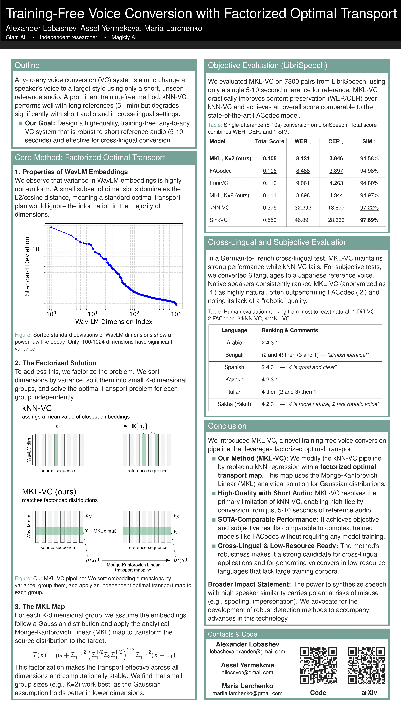

# Training-Free Voice Conversion with Factorized Optimal Transport [Interspeech 2025]
By [Alexander Lobashev](https://www.linkedin.com/in/alexander-lobashev-45b74b172/), [Assel Yermekova](https://linkedin.com/in/allessyer), [Maria Larchenko](https://www.linkedin.com/in/maria-larchenko-b654a936b/)

[](https://www.arxiv.org/abs/2506.09709)

 
We introduce Factorized MKL-VC, a training-free modification for kNN-VC pipeline. In contrast with original pipeline, our algorithm performs high quality any-to-any cross-lingual voice conversion with only 5 second of reference audio. MKL-VC replaces kNN regression with a factorized optimal transport map in WavLM embedding subspaces, derived from Monge-Kantorovich Linear solution. Factorization addresses non-uniform variance across dimensions, ensuring effective feature transformation. Experiments on LibriSpeech and FLEURS datasets show MKL-VC significantly improves content preservation and robustness with short reference audio, outperforming kNN-VC. MKL-VC achieves performance comparable to FACodec, especially in cross-lingual voice conversion domain.

This repository contains the source code and instructions for reproducing the results presented in our paper.

## Setup guide

```
git clone https://github.com/alobashev/mkl-vc
cd mkl-vc
cd models
pip install --upgrade gdown
gdown https://drive.google.com/uc?id=12-cB34qCTvByWT-QtOcZaqwwO21FLSqU
wget https://github.com/bshall/knn-vc/releases/download/v0.1/prematch_g_02500000.pt
wget https://github.com/bshall/knn-vc/releases/download/v0.1/g_02500000.pt
```
Then you can run the demo notebook. The main function for voice conversion is
```
run_inference(src_path, ref_path, result_path, batch_size=2)
```
You can try different batch_size values from 2 to 16, as it may affect the quality of the result.

If you are planning to use MKL-VC in production, it is recommended to apply speech enhancement to the final result.
We experimented with  [Resemble Enhance by ResembleAI](https://huggingface.co/spaces/ResembleAI/resemble-enhance).
The settings that we used are RK4 for CFM ODE Solver, 128 for CFM Number of Function Evaluations, 0 for CFM Prior Temperature, and checked Denoise Before Enhancement.
With these settings, we observe that most defects of MKL-VC are mitigated.

## Poster
 

## Citation
```
@inproceedings{
alobashev25,
title={Training-Free Voice Conversion with Factorized Optimal Transport},
author={Alexander Lobashev and Assel Yermekova and Maria Larchenko},
booktitle={Twenty sixth edition of the Interspeech Conference},
year={2025},
url={https://www.arxiv.org/abs/2506.09709}
}
```


